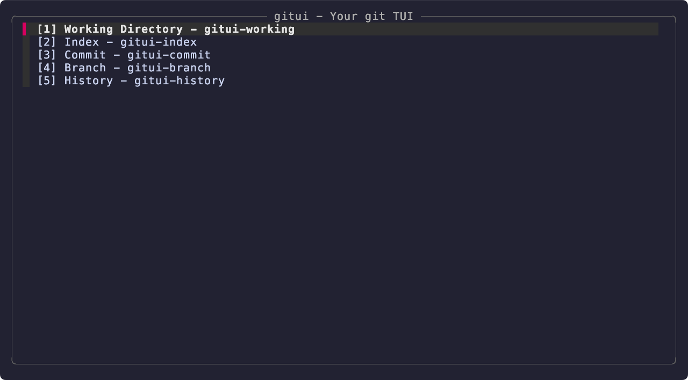
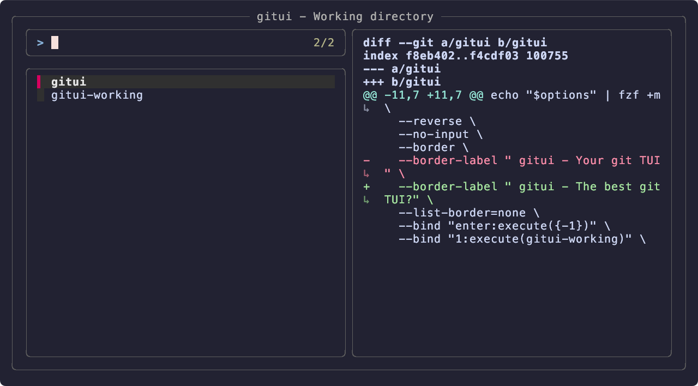
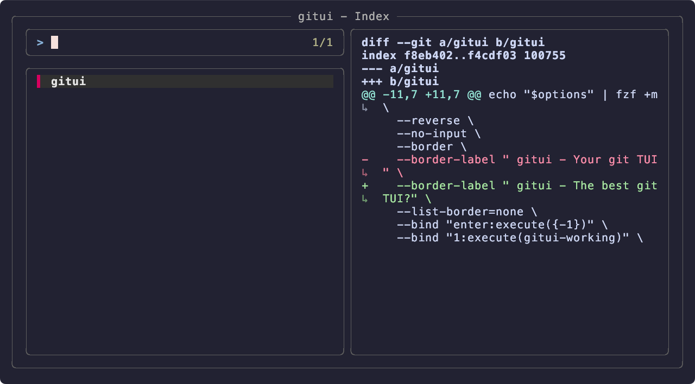
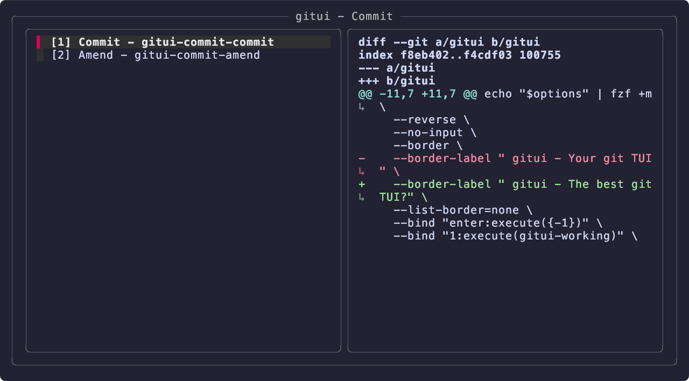
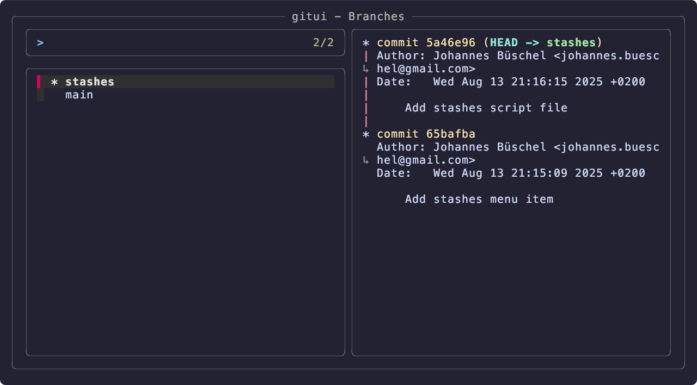
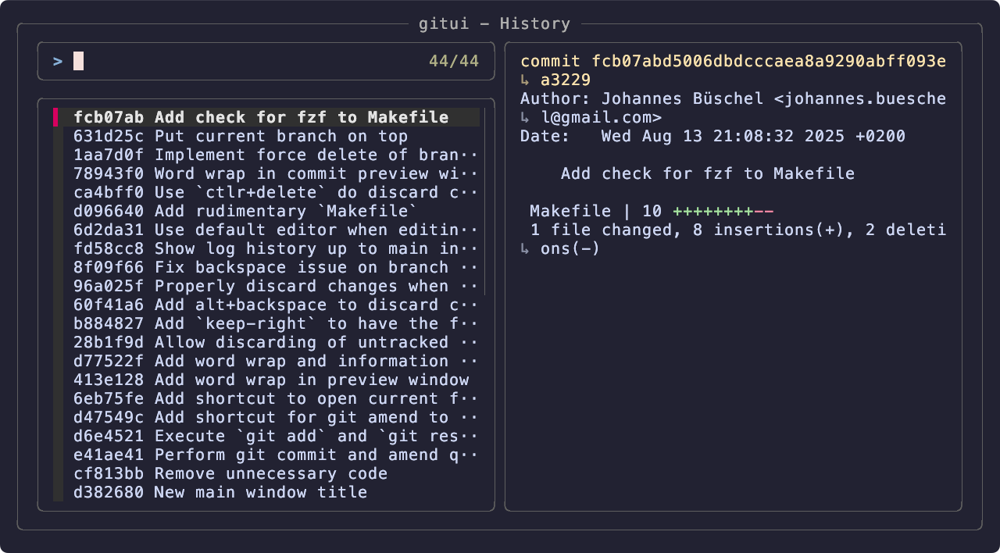

# gitui

gitui is a git Terminal User Interface build upon the amazing [fzf](https://junegunn.github.io/fzf/).

It is an experiment on what is possible with a few shell scripts and some string processing. The look and feel was influenced by the wonderful macOS tool [GitUp](https://github.com/git-up/GitUp).

## Installation

You need to have fzf installed for this to work.

At the moment you can only clone the repository. Afterwards, you can run one of the following commands:

| Command              | Description |
| :---                 | :--- |
| `make install`       | Installs gitui by copying the files to `~/.local/bin`. |
| `make install-links` | Installs gitui by creating symbolic links of all files in `~/.local/bin`. |
| `make uninstall`     | Removes all files in `~/.local/bin` that match `gitui*`. |

You can run `gitui` in any folder that contains a repository.

If this gets 10 stars, I might look into making this available on Homebrew 😅

## Views

| View              | Screenshot |
| :---              | :--- |
| Main              |  |
| Working Directory |  |
| Index             |  |
| Commit            |  |
| Branch            |  |
| History           |  |

## Shortcuts

The shortcuts below make the workflow as smooth as possible.

**Bonus:** Using `gitui` to switch branches, will automatically set your commit message template. Your branch naming just has to be of the form `<name>-<number>[...]` (yes, this also works with sub-branches like `subbranch/<name>-<number>[...]`).

| View              | Screenshot |
| :---              | :--- |
| Main              | 1-5: open the desired section esc: end the programm |
| Working Directory | enter: stage file ctrl-r: reload tab/ctrl-i: switch to Index ctrl-p: git patch the current file ctrl-e: open file in the default editor del: discard file |
| Index             | enter: unstage file ctrl-p: restore file in patch mode ctrl-r:reload ctrl-w: switch to Working Directory tab: switch to Commit ctrl-c: commit directly ctrl-a: amend directly |
| Commit            | 1: commit current index 2: amend current index tab: switch to Working Directory |
| Branch            | enter: switch to selected branch ctrl-r: show remote branches ctrl-l: show local branches ctrl-p: push currently selected branch (experimental) del: delete branch ctrl-del: force delete branch |
| History           | enter: show commits diff |

## Todos

So many ... an unordered list:

- Check if installation works on different machines
- Check if it works on Linux
- There is one script that is not in bash 😬 Look into it and make it a bash script
- More functionalities for branches (create branch)
- Stash support
- Match change state of files properly
